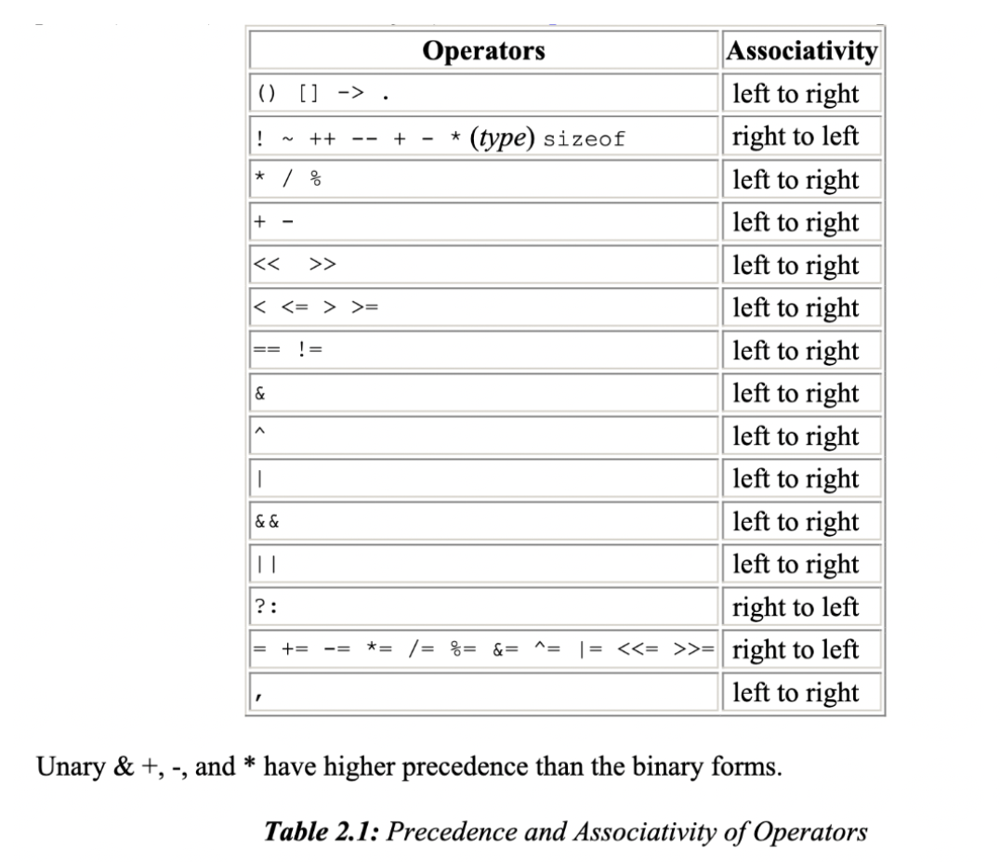

# lesson-3

### VSCode
In order to make editing your code easier, I reccomend downloading VScode. Choose the appropriate download option here: https://code.visualstudio.com/download
- To auto format your code on save - turn on "format on save" in your VScode settings
- To add extra support for C - add the C/C++ extension 


### Bitwise Operators
These can only be applied to integral operands, that is, char, short, int, and long, whether signed or unsigned.

- &  	bitwise AND
- |  	bitwise inclusive OR
- ^  	bitwise exclusive OR
- <<  	left shift
- \>> 	 right shift
- ~ 	 one's complement (unary)

Note that this is different than the logical operators && and ||. If x=1, and y=2, x & y = 0, but x && y=1.

The shift operators << and >> perform left and right shifts of their left operand by the number of bit positions given by the right operand, which must be non-negative. Thus x<<2, shifts the value of x by two positions, filling vacated bits with zero; this is equivalent to multiplication by 4. Right shifting an unsigned quantity always fits the vacated bits with zero, signed quantities have differing behavior based on the machine.

```c

#include <stdio.h>

int main()
{
    printf("5 & 4 = %d\n", 5 & 4);
    printf("5 | 4 = %d\n", 5 | 4);
    printf("5 ^ 4 = %d\n", 5 ^ 4);
    printf("5 << 2 = %d\n", 5 << 2);
    printf("12 >> 2 = %d\n", 12 >> 2); //1100 becomes 0011
    printf("~5 = %d\n", ~5);
    // Note 2's complement
    // 5 is 0000...0101
    // Doing on's complement, we have
    // ~5 is 1111...1010
    // which is MIN+sum(2^n) where n excludes n=0 and n=2
    // Or simpler: -8 + 0 + 2 + 0
    return 0;
}

```
#### Summary:
-  to flip the sign, get the two's complement = one's complement of binary number + 1 (ignore the overflowed bit)
```
decimal = 5
binary = 0000 0101
one's complement = 1111 1010
two's complement (negative 5) = 1111 1010 + 0000 0001 = 1111 1011

decimal = -5
binary = 1111 1011
one's complement = 0000 0100
two's complement (positive 5) = 0000 0100 + 0000 0001 = 0000 0101
```
- to get the decimal value of a signed number, take leftmost bit of two's complement as negative value and add up the rest 
```
two's complement = 1111 1011 = -128 + 64 + 32 + 16 + 8 + 2 + 1 = -128 + 123 = -5
```
- note that the two's complement positive # + two's complement negative # = 0
```
decimal = 5
two's complement positive # = 0000 0101
two's complement negative # = 1111 1011
one's complement + two's complement =  0000 0101 + 1111 1011 = 1
```


Video to review two's complement and negative numbers: https://www.youtube.com/watch?v=4qH4unVtJkE

Another helpful resource: https://www.cs.cornell.edu/~tomf/notes/cps104/twoscomp.html

### Assignment Operators 
- i = i + 2 is equivalent to i += 2
- i = i - 2 is equivalent to i -= 2
- expr1 = (expr1) op (expr2) is equivalent to expr1 op= expr2
- Also works for: * / % << >> & ^ |
- Commonly used in loops
- x *= y + 1 is the same as x = x *(y+1)

Assignment operators can occur in expressions as well, the same way that we have seen:
while (( c = getchar()) != EOF)

++ and – may be used either as a prefix or postfix operator. In both cases, the effect is to increment n, but ++n increments n before its value is used, while n++ increments n after its value has been used. 

x= n++; sets x to 5, but, 
x=++n; sets x to 6. In both cases, n becomes 6.


```c
#include <stdio.h>
int main()
{
    int var1 = 5, var2 = 5;
    printf("var1: %d\n", var1);
    printf("var1 postfix increment: %d\n", var1++);
    printf("var1:%d\n", var1);
    printf("------------------\n");
    printf("var2: %d\n", var2);
    printf("var2 prefix increment: %d\n", ++var2);
    printf("var2: %d\n", var2);

    return 0;
}
```
OR the postfix and prefix can be used to increment a char
```c
if (c == '\n') {
	s[i] = c;
	++i;
}
```
Can be replaced to:
```c
if (c == '\n') {
	s[i++] = c;
}
```


### Precedence & Associativity Operators
The “operator” () refers to a function call. The operators -> and . are used to access members of structures, sizeof (size of an object), * (indirection through a pointer) and * (address of an object), and comma operator will all be discussed in later chapters.




& is unary, && is binary.

#### operator precedence example:
```c
#include <stdio.h>
int main()
{
    int a = 20;
    int b = 10;
    int c = 15;
    int d = 5;
    int e;
    e = (a + b) * c / d;
    printf("Value of (a + b) * c / d : %d\n", e);
    e = ((a + b) * c) % a;
    printf("Value of ((a + b) * c) is : %d\n", e);
    e = (a - d) >> 2;
    printf("Value of (a - d) >> 2 is : %d\n", e);
    e = a - (d >> 2);
    printf("Value of  a - (d >> 2) is : %d\n", e);
    e = (a && b) << 3;
    printf("Value of (a && b) << 3 is : %d\n", e);
    return 0;
}
```

C, like most languages, does not specify the order in which operands of an operator are evaluated. The exceptions are &&, ||, ?: and ‘,’). For example, in a statement like x = f() + g(); f may be evaluated before g or vice versa. Same goes with printf(“%d %d\n”, ++n, power(2, n));.  Another situation in which order might matter is a[i] = i++; The moral is that writing code that depends on order of evaluation is a bad programming practice in any language.

### Conditional Statements

#### IF Statements
```c
if (a > b) 
{
    z = a; // do something
}
```
—--------------
```c
#include <stdio.h>

int main()
{
    int a  = 0;
    int b = 5;
    if (a < b)
    {
        printf("a is less than b\n");
    }
    return 0;
}
```

#### IF-ELSE Statements
```c
if (a > b) 
{
    z = a; // do something
}
else
{
    z = b; // do something else
}
```
or

expr1 ? expr 2 : expr 3
Note that if expr2 and expr3 are of different types, the type of the result is determined by the conversion result discussed earlier in this chapter. If f is a float and n an int, then the expression (n>0)? f : n is of type float regardless of whether n is positive.

In general it is better to use braces to make it clear which else is associated with which if. Indentation/spacing does not matter so you must make it clear to the compiler if you have nested if/else.

  
#### IF-ELSE Statement Example
```c
#include <stdio.h>

int main()
{
    int a = 7;
    int b = 5;
    if (a < b)
    {
        printf("a is less than b\n");
    }
    else
    {
        printf("a is greater than or equal to b\n");
    }
    return 0;
}
```

#### IF-ELSE IF-ELSE Statements
```c
if (a > b) 
{
    z = a; // do something
}
else if (a > c)
{
    z = c; // do something
}
else
{
    z = b; // do something else
}
```

#### IF-ELSE IF-ELSE Statement Example
```c
#include <stdio.h>

int main()
{
    int a = 1;
    int b = 2;
    int c = 3;
    if (a < b)
    {
        printf("a is less than b\n");
    }
    else if(a < c)
    {
        printf("a is less than c and greater than or equal to b\n");
    }
    else
    {
        printf("a is greater than or equal to b and a is greater than or equal to c\n");
    }
    return 0;
}

```

### BASIC INPUT/OUTPUT
Text input or output, regardless of where it originates or where it goes to, is dealt with as streams of characters. A text stream is a sequence of characters divided into lines;each line consists of zero or more characters followed by a newline character. 
getchar() - reads the next input character from a text stream and returns that as its value.
putchar(c) - prints the contents of the integer variable c as a character, usually on the screen.

Run the file with an input file like this:
```
gcc test.c
./a.out < inputfile.txt
```

#### GETCHAR
gets one character from the command line
```c
#include <stdio.h>

int main()
{
    char c = getchar();
    printf("-------\n");
    putchar(c);
    printf("\nthe value of the char c is %c\n", c);

    return 0;
}
```

In this example, we used int for c because we must declare c to be a type big enough to hold any value that getchar() returns. When there is no more input, the end of file (EOF) value is returned. EOF is an integer defined in <stdio.h> but the specific numeric value does not matter as long as it is not the same as any char value.
```c
#include <stdio.h>
/* copy input to output; 1st version */
main()
{
	int c;
	
	c = getchar();
	while( c != EOF) {
		putchar(c);
		c = getchar();
	}
}
```

Can be simplified to below:
```c
#include <stdio.h>
/* copy input to output; 1st version */
main()
{
	int c;
	while( (c = getchar()) != EOF) {
		putchar(c);
	}
}
```

### SWITCH STATEMENTS
Another way to write if, else-if, and else
Each const-expr is a constant integer value
Each case is like an if, default is like the else
Limited by the number of chars/ints
Default it optional - if none of the cases are there and there is no default, then nothing happens
Must use breaks  to cause an exit from the switch and not execute the next case
```c
switch(expression) {
  case const-expr: statements
  case const-expr: statements
  default: statements
}

```

#### SWITCH STATEMENT EXAMPLE
break causes the switch to end, otherwise, it will continue to the next case

echo $? will show the result of the program
```c
#include <stdio.h>

// This is a simplified version of the example on K&R pg. 59
// Loops and arrays are removed from this example
// We will build upon this example as we continue
int main()
{
    int c, i, nwhite, nother, ndigit;
    nwhite=nother=ndigit=0;

    c = getchar();
    switch (c)
    {
        case '0': // same as 48
        case '1':
        case '2':
        case '3':
        case '4':
        case '5':
        case '6':
        case '7':
        case '8':
        case '9':
            ndigit++;
            break;
        case ' ':
        case '\n':
        case '\t':
            nwhite++;
            break;
        default:
            nother++;
            break;
    }
    printf("ndigits = %d", ndigit);
    printf(", white space = %d, other = %d\n", nwhite, nother);


    return 0;
}
```

Break is not needed in the default case, but it is a good idea to leave it there for defensive programming. If more cases are added later after default, and the programmer forgets to update the prior case, this will make sure that the code does not continue execution to the next case.


#### Looking Ahead
https://www.programiz.com/c-programming/examples/calculator-switch-case 
```c
#include <stdio.h>

int main() {

  char op;
  double first, second;
  printf("Enter an operator (+, -, *, /): ");
  scanf("%c", &op);
  printf("Enter two operands: ");
  scanf("%lf %lf", &first, &second);

  switch (op) {
    case '+':
      printf("%.1lf + %.1lf = %.1lf", first, second, first + second);
      break;
    case '-':
      printf("%.1lf - %.1lf = %.1lf", first, second, first - second);
      break;
    case '*':
      printf("%.1lf * %.1lf = %.1lf", first, second, first * second);
      break;
    case '/':
      printf("%.1lf / %.1lf = %.1lf", first, second, first / second);
      break;
    // operator doesn't match any case constant
    default:
      printf("Error! operator is not correct");
  }

  return 0;
}
```


## HOMEWORK:
- The C Programming Language, 2nd Edition - Kernighan & Ritchie, Chapter 2.6-2.12, 3.1-3.3, 1.5
- Coding Homework: https://classroom.github.com/a/ae8plVDI


